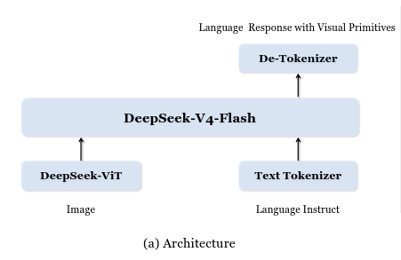
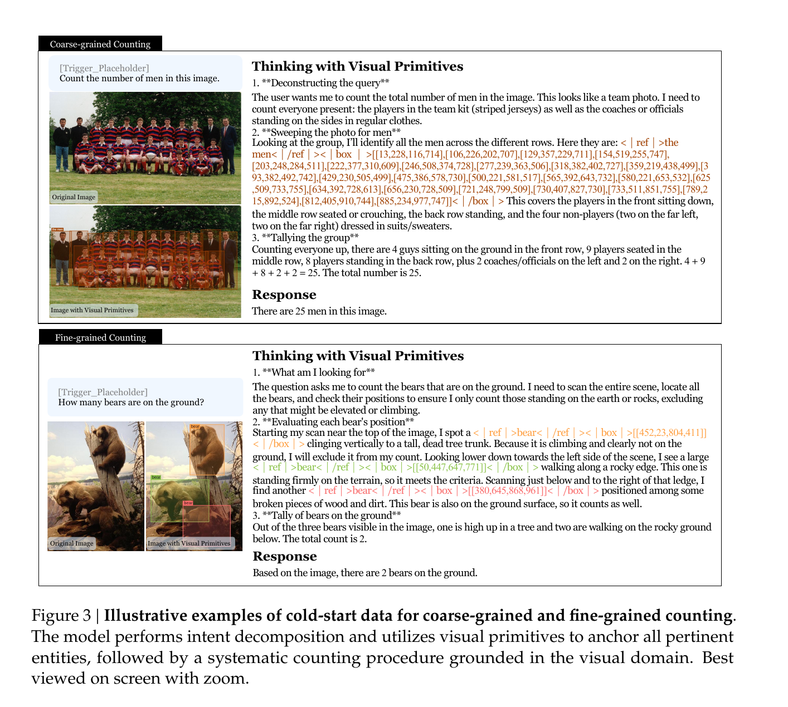
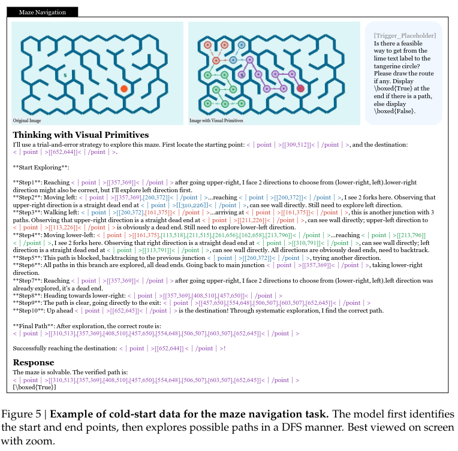
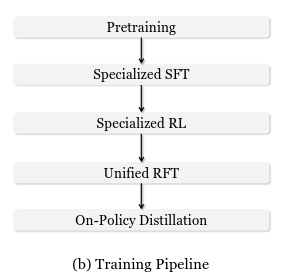
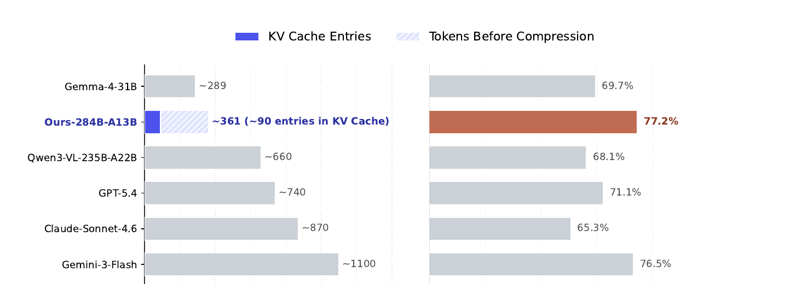
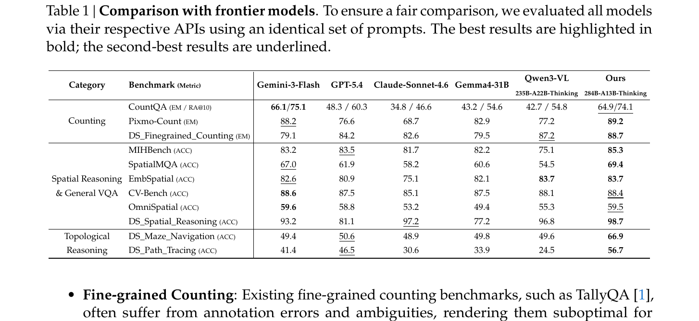
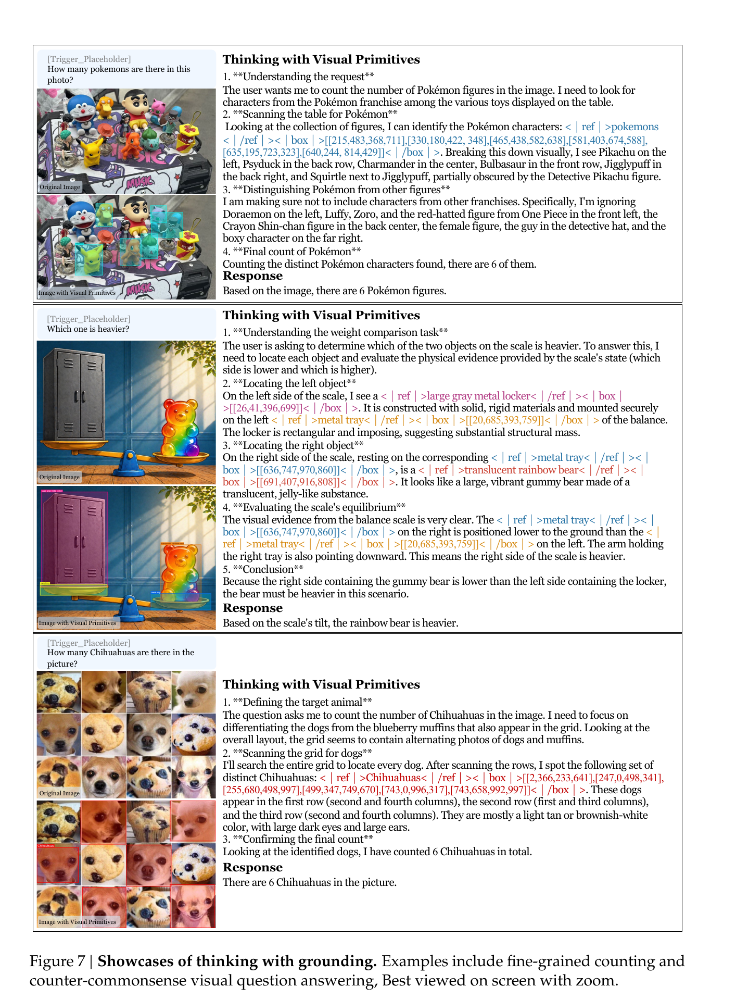
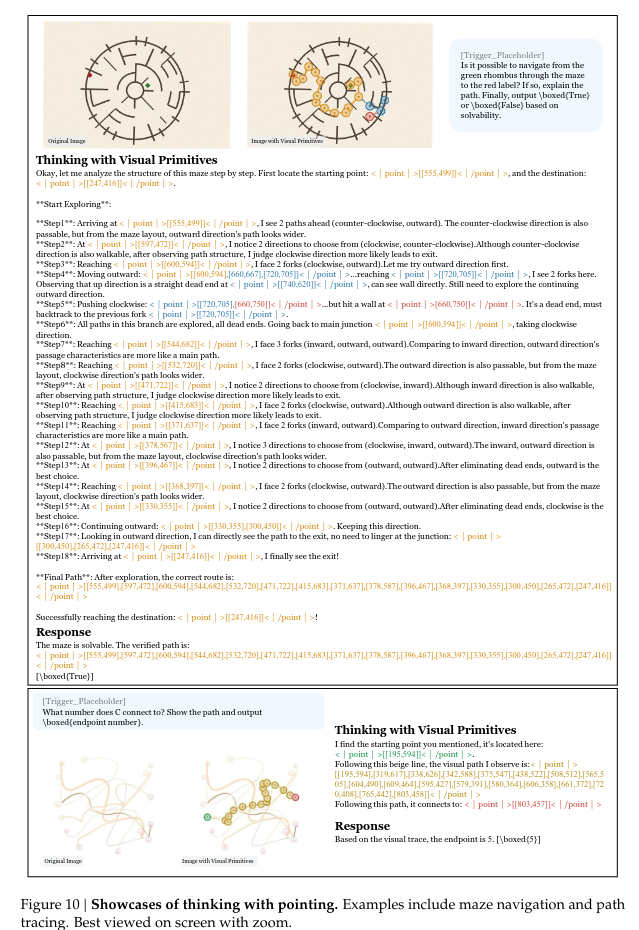

<!-- _class: cover-->
<!-- _paginate: false-->

# Thinking with Visual Primitives

## Elevating spatial markers to "minimal units of thought"

Uchida Lab M1
[Your Name]

---

# Motivation for Reading

- Curious about how MLLMs handle **spatial reasoning** beyond simple object detection.

- A very recent paper from DeepSeek-AI proposing a novel approach to multimodal Chain-of-Thought.

- The idea of inserting **visual references (points and boxes) directly into the thinking process** felt genuinely new.

- Claims to match GPT-5.4 / Claude-Sonnet-4.6 / Gemini-3-Flash while using far fewer image tokens.

---

# Research Overview

- Proposes a reasoning framework to address the **"Reference Gap"** in conventional MLLMs.

- Defines **Visual Primitives** — bounding boxes and points — as the minimal units of thought, interleaved directly into Chain-of-Thought traces.

- Built on a highly token-efficient MoE architecture (284B total / 13B active parameters) with aggressive KV cache compression.

- Achieves frontier-competitive performance on counting, spatial reasoning, and topological tasks (mazes, path tracing).

---

<!-- _class: section_title -->
# Background: The Reference Gap

---

# Perception Gap vs. Reference Gap

### Perception Gap

- "Can the model **see** the details?"
- Addressed by high-resolution cropping and dynamic patching.
- e.g., *Thinking with Images*.

### Reference Gap

- "Can the model **point to** what it sees?"
- Natural language is too ambiguous to identify exact spatial layouts.
- Not solved by better perception alone.

The paper argues that frontier MLLMs have made progress on perception, but still lack a robust and unambiguous reference mechanism — and that's where logical collapse happens.

---

# Why language alone is not enough

- In tasks like dense counting or topological navigation, linguistic "thoughts" lose track of **which visual entity is being referenced**.

- This leads to **cascading hallucinations**: once the referent drifts, every subsequent reasoning step compounds the error.

- Humans naturally use **deictic pointers** (finger gestures) to reduce cognitive load when navigating mazes or counting dense scenes.

## → Give the model the same ability: let it "point while it reasons"

---

# Prior work: grounding as post-hoc verification

Existing approaches (Visual CoT, GRIT, VGR) integrate bounding boxes into CoT, but:

- Treat grounding as a **verification mechanism**, not a reasoning medium.

- Focused on perception-heavy tasks (high-resolution benchmarks).

- Rely on labor-intensive supervision → limited scalability.

- Fail on **structural reasoning** like maze navigation, where visual markers must *be* the thought, not evidence for it.

---

<!-- _class: section_title -->
# Proposed Method
## Thinking with Visual Primitives

---

# Two types of visual primitives

### Bounding Boxes

$$
b = [x_1, y_1, x_2, y_2]
$$

- Capture **exact location and scale**.
- Deterministic annotations.
- Rich geometric information.

### Points

$$
p = [x, y]
$$

- **Abstract** spatial referencing.
- Good for trajectories and topology.
- Ambiguous (no strict ground truth).

Coordinates normalized to integers in $[0, 999]$. Box training data is prioritized because a box implicitly contains two points → boxes generalize to points naturally.

---

# Interleaving language and visual primitives

Traditional Chain-of-Thought:

$$
y = (w_1, w_2, \ldots, w_T)
$$

Proposed reasoning trace:

$$
y = (w_1, v_1, w_2, v_2, \ldots, w_T, a) \quad \text{where} \quad v_t \in \{\text{point}, \text{box}\}
$$

**Intuition:** this mimics how humans solve visual tasks — by *pointing, tracing, marking, and checking* while reasoning, rather than describing from memory.

---

# Output format

**Box grounding:**

&lt;|ref|&gt;TARGET&lt;|/ref|&gt;&lt;|box|&gt;[[x1,y1,x2,y2],...]&lt;|/box|&gt;

**Point referencing:**

&lt;|point|&gt;[[x1,y1],[x2,y2],...]&lt;|/point|&gt;

- `<|ref|>`, `<|box|>`, `<|point|>` are special tokens in the vocabulary.
- Point format intentionally **omits the object name** → enables abstract uses like trajectories.

---

# Architecture

LLaVA-style architecture:

- **DeepSeek-ViT** (in-house) for vision encoding.
- **DeepSeek-V4-Flash** (MoE, 284B total / 13B active) as the LLM backbone.
- **Compressed Sparse Attention (CSA)** for KV cache compression.

---

# Token compression derivation

For a $756 \times 756$ image with ViT patch size $P = 14$:

$$
N_{\text{patch}} = \left\lceil \frac{756}{14} \right\rceil^2 = 54^2 = 2{,}916
$$

After $3 \times 3$ spatial token compression:

$$
N_{\text{LLM}} = \frac{N_{\text{patch}}}{9} = \frac{2916}{9} = 324
$$

After CSA with compression factor $m = 4$:

$$
N_{\text{KV}} = \frac{N_{\text{LLM}}}{m} = \frac{324}{4} = 81
$$

## Overall compression: $\dfrac{756 \times 756}{81} = \mathbf{7{,}056\times}$

---

# Pretraining data: large-scale curation

Public datasets (COCO, Pixmo-Points) lack scale and diversity. The paper builds box-grounding data from large-scale web scraping:

**Data funnel:**

$$
97{,}984 \text{ sources} \xrightarrow{\text{Semantic Review}} 43{,}141 \xrightarrow{\text{Geometric Review}} 31{,}701 \rightarrow 40\text{M+ samples}
$$

### Step I: Semantic Review (MLLM-based)
Discards meaningless codes ("0", "1"), private entities ("MyRoommate"), ambiguous labels ("OK", "NG").

### Step II: Geometric Review
Discards datasets with severe missing annotations (>50%), severe truncation, or "mega boxes" covering >90% of image.

---

# Cold-start data: 4 task families

| Task | Samples | Primitive |
|---|---|---|
| **Counting** (coarse + fine-grained) | ~10k | Boxes |
| **Spatial Reasoning & VQA** (GQA + CLEVR) | ~9k | Boxes |
| **Maze Navigation** (DFS/Prim/Kruskal) | ~460k | Points |
| **Path Tracing** (Bézier curves) | ~125k | Points |

The cold-start data provides explicit intermediate supervision verified by automatic checkers (e.g., the box coordinates in the thinking trace must match the metadata).

---

# Cold-start example: fine-grained counting

The thinking trace **anchors each candidate object with a bounding box** before tallying.

---

# Maze navigation as reachability

Treat the maze as a graph $G = (V, E)$ where $V$ are cells/junctions, $E$ are valid moves not blocked by walls, $s \in V$ is the start, $t \in V$ is the target.

**Solvability is a reachability problem:**

$$
\exists \, P = (v_0, v_1, \ldots, v_L) \quad \text{s.t.} \quad v_0 = s, \; v_L = t, \; (v_\ell, v_{\ell+1}) \in E
$$

Visual primitives represent **route waypoints**:

$$
\langle p_0, p_1, \ldots, p_L \rangle
$$

Each waypoint $p_\ell$ is a concrete image coordinate — turning topology into a verbalized point-trace.

---

# Cold-start example: maze navigation

Explicit **DFS with backtracking**, every step anchored by a point coordinate.

---

# Post-training pipeline: "train specialists → merge"

1. **Specialized SFT**: train two separate models — $F_{\text{TwG}}$ (boxes) and $F_{\text{TwP}}$ (points).
2. **Specialized RL** (GRPO): independently RL each expert → $E_{\text{TwG}}$, $E_{\text{TwP}}$.
3. **Unified RFT**: use experts to generate rollouts, retrain unified model $F$.
4. **On-Policy Distillation**: distill both experts into $F$.

---

# Reward design: Counting accuracy

To avoid the harshness of binary exact-match, the paper uses **smooth exponential decay** on relative error:

**Counting Reward Function:**

$$
R(\hat{y}, y) = \alpha \cdot \exp\!\left(-\beta \cdot \frac{|\hat{y} - y|}{|y| + 1}\right)
$$

- $\hat{y}$: predicted count, $y$: ground-truth count.
- $|y| + 1$ denominator → small deviations more tolerable in dense scenes.
- In practice: $\alpha = 0.7$, $\beta = 3$.

→ Near-correct predictions are lightly penalized; large errors get sharply lower scores.

---

# Reward design: Other tasks

### Spatial Reasoning / VQA
LLM-based Generative RM scores both the thinking content and the final response, then averages.

### Maze Navigation
Weighted sum of: causal exploration progress, exploration completeness (for unsolvable mazes), wall violation penalty, final path validity, answer correctness.

### Path Tracing
Bidirectional trajectory distance + endpoint accuracy + continuity penalty + answer correctness.

---

# Difficulty-aware data selection for RL

Before RL, run $N$ rollouts per sample with the SFT model and bucket the data:

- **Easy-Level** — all $N$ rollouts correct → too easy, skip.
- **Normal-Level** — $1 \le k < N$ correct → use these for GRPO.
- **Hard-Level** — $0$ correct → too hard, skip.

→ Ensures the model receives **informative gradient signal** during RL.

For unified RFT: keep all Normal-Level + 5% of Easy-Level (to prevent catastrophic forgetting).

---

# On-Policy Distillation objective

After RFT, the unified model $F$ still lags the experts. To close the gap, distill both experts into $F$:

**OPD Loss Function:**

$$
\mathcal{L}_{\text{OPD}}(\theta) = \sum_{i=1}^{N} w_i \cdot D_{\text{KL}}\!\left(\pi_\theta \,\|\, \pi_{E_i}\right)
$$

- $\pi_\theta$: student (unified model).
- $\pi_{E_i}$: expert teachers ($E_{\text{TwG}}$, $E_{\text{TwP}}$).
- $D_{\text{KL}}$: **reverse** KL divergence.
- Full-vocabulary logit distillation on the student's own rollouts (on-policy).

---

<!-- _class: section_title -->
# Experiments

---

# Benchmarks

### Public benchmarks
- Counting: CountQA, Pixmo-Count
- Spatial: SpatialMQA, CV-Bench, EmbSpatial, OmniSpatial, MIHBench

### In-house benchmarks (DS_*)
- DS_Finegrained_Counting
- DS_Spatial_Reasoning (CLEVR-based)
- DS_Maze_Navigation
- DS_Path_Tracing

⚠ The DS_* benchmarks are built using the <b>same methodology as the training data</b> — worth being skeptical about.

---

# Token efficiency vs performance

For an 800×800 image: ~90 KV cache entries (vs ~1100 for Gemini-3-Flash). Average across **7 public benchmarks**: **77.2%** vs GPT-5.4's 71.1%.

---

# Comparison with frontier models

---

# Reading Table 1 carefully

- **Counting / Spatial Reasoning (public benchmarks):** competitive with or beats GPT-5.4, Claude-Sonnet-4.6, Gemini-3-Flash.

- **DS_Maze_Navigation:** 66.9% vs ~50% for everyone else.

- **DS_Path_Tracing:** 56.7% vs 24–46% for others.

The topological-reasoning gap is enormous — but those benchmarks are constructed *by the authors* using the same procedural pipeline as the training data.

→ Fair takeaway: on standard tasks the method genuinely competes with frontier models using a fraction of the tokens. On topology, the result is striking but **the evaluation is in-distribution**.

---

# Qualitative results: boxes as primitives

The model decomposes intent, anchors each entity with a box, then tallies / reasons over the anchored set.

---

# Qualitative results: points as primitives

Explicit DFS exploration + backtracking, with every step grounded by a point coordinate.

---

# Limitations (acknowledged by authors)

### 1. Resolution constraint
Fine-grained scenes still suffer from imprecise primitive outputs → could be combined with Perception-Gap methods.

### 2. Trigger-word dependency
The "thinking with visual primitives" mode is currently activated by an **explicit trigger**, not autonomously.

### 3. Topological generalization
Points-as-primitives works **in-domain** but doesn't transfer broadly across scenarios yet.

---

# Impressions

- Treating image coordinates directly as **thought tokens**, rather than relying purely on text-based CoT, is an extremely powerful framework.

- The smooth exponential decay reward elegantly handles the MLLM-specific weaknesses of omission and double-counting.

- Token efficiency story is genuinely impressive: ~90 KV entries vs ~1100 is a huge architectural win.

- But the topological-reasoning numbers should be read carefully — training and eval data share the same synthetic pipeline.

- **Open question:** can "thinking with visual primitives" emerge *without* such heavy task-specific cold-start data?

---

<!-- _class: fs32 -->

# Takeaway

## Think in language, but anchor in vision.

Visual primitives make multimodal reasoning less like *describing an image from memory*, and more like **actively pointing, tracing, checking, and counting inside the image**.

→ For System-2 multimodal AI, a precise *reference mechanism* may matter as much as — or more than — simply adding more pixels.